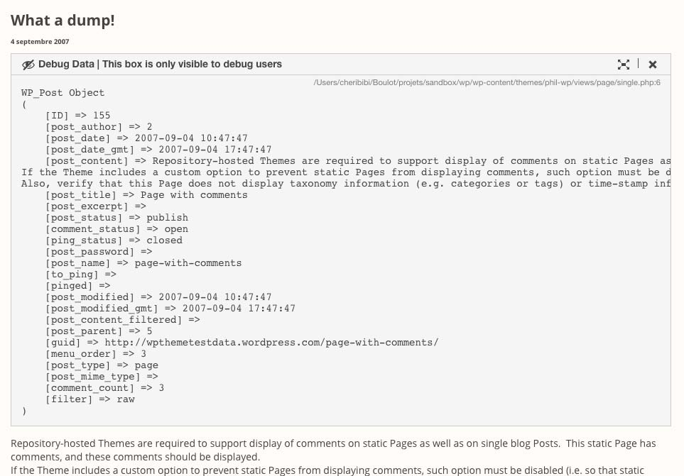
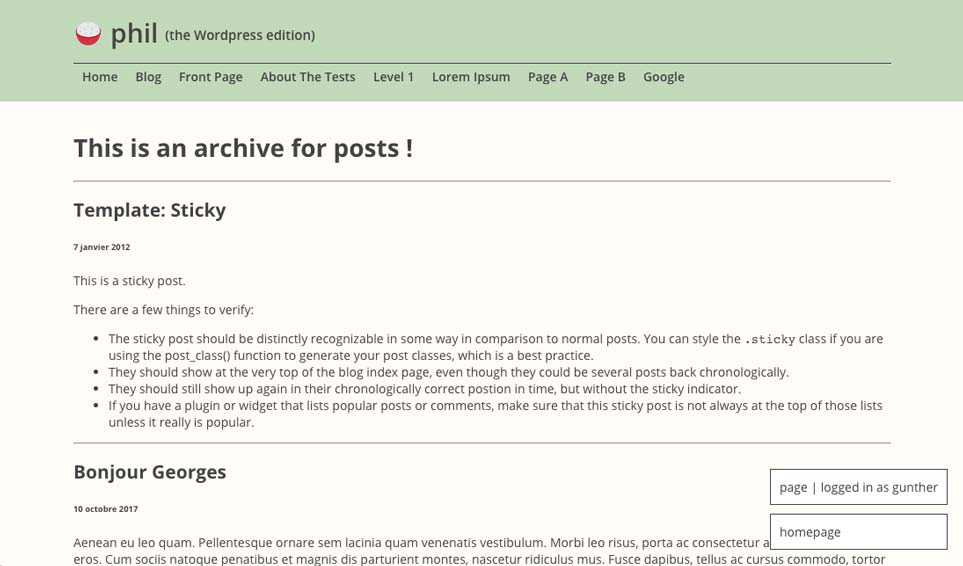

## For Your Eyes Only

Beautiful var_dump/print_r __for selected users only__ not relevant to capabilities!

No more client calling you in the middle of the night because you forgot a `print_r($wp_query->vars)` or a `echo "hello"` and they happen to be admin too... __Those are for your "debug users" eyes only__

## Install 

1. Upload plugin
2. Activate plugin
3. Copy following functions to your functions.php
4. Go to Wordpress admin Settings/For Your Eyes Only and select your debug users.
5. Use the functions wherever in your theme without worrying.

## Functions available

### is_debug_user($user)

Test if $user is current user, default to current_user.

### ardump($content, $title)

Shows a nice readable array of data that you can close, extend etc...



### arquick($content)

For the simple string display function (just a `<pre>` really):

### addSticky($content)
Allow you from anywhere in your code to add a sticky box in the bottom right corner of the browser what will show up above everything else. Useful for post type, current user and other little debug data.



## in your functions.php:

__IMPORTANT__: In order to avoid a the fatal **Call to undefined function** error in case the plugin is deactivated, you should add the functions to your function.php yourself to check if class exists.

The name of the functions doesn't really matter, except for the backtrace info in ardump. I locate the right one by using the 'ardump' function name.

```php

/**
 * is_debug_user Check if user is a For Your Eyes Only debug user.
 * @param  int $user_id Wordpress' user id, default to current user.
 * @return boolean          true if user is among debug users, false if not.
 */
function is_debug_user($user_id = false){
    if(class_exists('jsComponent')){
        $t = new jsComponent;
        return $t->is_debug_user();
    }
    return false;
}

/**
 * ardump Output some nice dump for 'debug users' only.
 * @param  [string|array] $content The content to output in the dump
 * @return nothing
 */
function ardump($content, $title = false) {
    if(class_exists('jsAlert')){
        $alert = new jsAlert;
        $alert->ardump($content, $title);
    } else {
        return;
    }
}

/**
 * arquick Print a simple string for 'debug users' only.
 * @param  [string] $content The string to output
 * @return nothing
 */
function arquick($content) {
    if(class_exists('jsAlert')){
        $alert = new jsAlert;
        $alert->arquick($content);
    } else {
        return;
    }
}

/**
 * Function from ardump to add sticky element on body with debug info.
 * @param [string/array] $data The sticky to add to body
 */
function addSticky($data){
    if(class_exists('Sticky')){
        global $StickyData;
        new Sticky($StickyData, $data);
    } else {
        return;
    }
}
```
